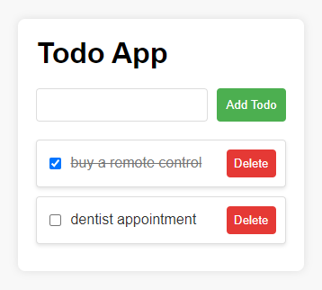

# Typed Todo App

This is a simple Todo App built with React and TypeScript, featuring a typed state management system.

## Getting Started

1. Clone the repository:
   ```bash
   git clone https://github.com/Mohammad-AbuJaber/typed-todo-app
    ```
2. Navigate to the project directory:
   ```bash
   cd typed-todo-app
   ```
3. Install dependencies:
   ```bash
    npm install
    ```
4. Run the app:
    ```bash
     npm start
     ```

Or you can visit the [live demo](https://mohammad-abujaber.github.io/typed-todo-app/).

## Features

- Add, toggle, and delete todos.
- Typed state management using React useReducer.

## Project Structure

- **components/**: Contains React components for the Todo App.
    - **TodoApp.tsx**: Main component for the Todo App.
    - **TodoItem.tsx**: Component for individual Todo items.

- **styles/**: Holds CSS styles for the components.
    - **TodoApp.css**: Styles for the TodoApp component.
    - **TodoItem.css**: Styles for the TodoItem component.

- **redux/**: Manages state using Redux pattern.
    - **actions.ts**: Defines actions for adding, toggling, and deleting todos.
    - **reducer.ts**: Implements the reducer logic for handling todo-related actions.
    - **types.ts**: Contains type definitions for the Redux state.

- **index.tsx**: Entry point of the application.

## Screenshot



## License

This project is licensed under the MIT License. See the [LICENSE](LICENSE) file for details.
